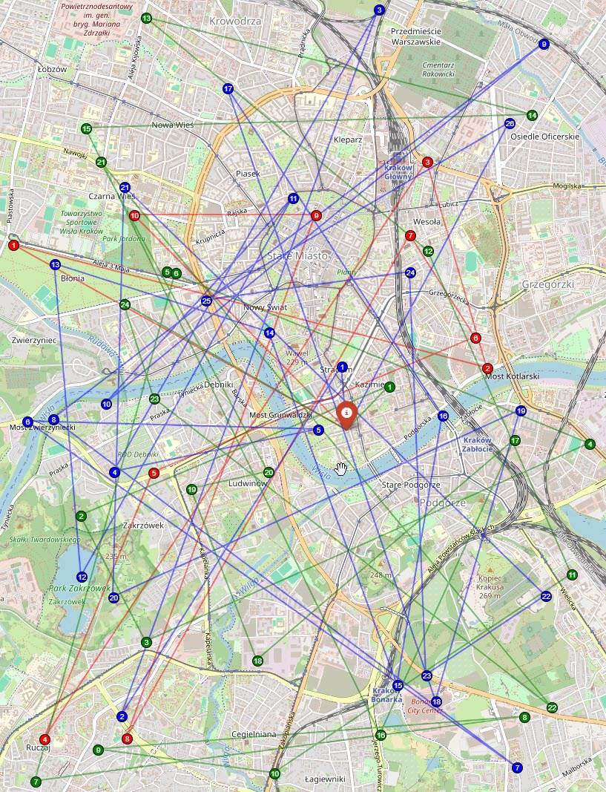
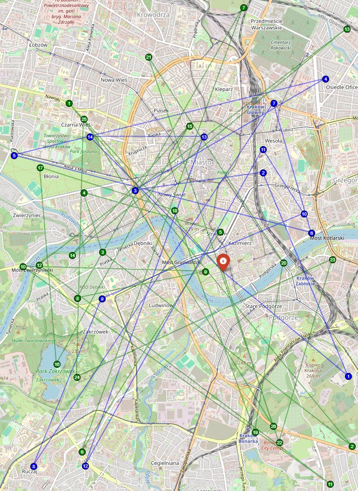
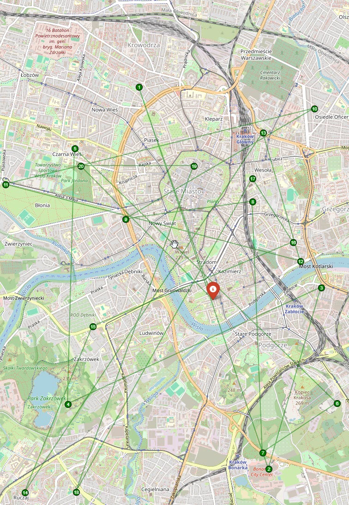

## 0. Uruchamianie programu

Aby uruchomić program, należy użyć poniższych komend:

- Uruchomienie programu z **40 klientami** i strategią `PATH_CHEAPEST_ARC`:
  ```bash
  py -3.11 main.py --num_clients=40 --strategy=PATH_CHEAPEST_ARC
  ```
- Uruchomienie programu z **20 klientami** (domyślna strategia `PATH_CHEAPEST_ARC`):
  ```bash
  py -3.11 main.py --num_clients=20
  ```
- Uruchomienie programu z **domyślną liczbą klientów (60)** i strategią `PATH_CHEAPEST_ARC`:
  ```bash
  py -3.11 main.py
  ```

# Optymalizacja tras dostaw chleba w Krakowie

## 1. Wprowadzenie

Problem **Vehicle Routing Problem (VRP)** odnosi się do optymalizacji tras dostaw w taki sposób, aby zminimalizować koszty transportu, czas przejazdu lub inne kluczowe wskaźniki efektywności.  
W niniejszym projekcie rozwiązujemy problem optymalizacji dostaw chleba z piekarni do sklepów w Krakowie. Wykorzystujemy do tego algorytmy optymalizacyjne **Google OR-Tools** oraz narzędzie **OSRM** do wyznaczania odległości między punktami.

## 2. Opis problemu

**Scenariusz**:  
Mamy piekarnię, która codziennie dostarcza chleb do sklepów na terenie Krakowa. Każdy sklep składa zamówienie na określoną liczbę bochenków chleba, a dostawy realizowane są przy użyciu trzech dostępnych pojazdów dostawczych. Celem jest zoptymalizowanie tras kurierów w taki sposób, aby całkowity koszt transportu był jak najniższy.

**Ograniczenia problemu**:

- **Liczba pojazdów**: 3
- **Pojemność pojazdu**: 300 bochenków chleba
- **Liczba sklepów**: 60
- **Zamówienia chleba**: 5-20 sztuk na sklep

## 3. Rozwiązanie problemu

### 3.1 Użyte technologie

- **Google OR-Tools** – biblioteka optymalizacyjna do rozwiązywania problemów VRP
- **OSRM (Open Source Routing Machine)** – obliczanie macierzy odległości
- **OpenStreetMap** – wizualizacja tras dostaw

### 3.2 Struktura rozwiązania

- **data_loader.py** – Wczytuje listę sklepów z pliku CSV i losuje klientów do obsłużenia.
- **distance_matrix.py** – Generuje macierz odległości między lokalizacjami na podstawie OSRM.
- **vrp_solver.py** – Implementuje algorytm VRP w Google OR-Tools, zapewniając optymalne rozwiązanie tras.
- **routes_visualizer.py** – Tworzy wizualizację tras na mapie Krakowa.
- **main.py** – Zarządza całym procesem i uruchamia rozwiązanie.

### 3.3 Algorytm optymalizacyjny

Wykorzystano strategię **PATH_CHEAPEST_ARC**, która minimalizuje koszty trasy, wybierając najkrótszą dostępną drogę do następnego punktu.

## 4. Wizualizacja i analiza wyników

Po uruchomieniu programu generowane są optymalne trasy dla 3 pojazdów. Wyniki prezentowane są zarówno w formie tekstowej (kolejność odwiedzin sklepów i dystans trasy), jak i graficznej w postaci mapy (**vrp_route_map.html**).

### Wyniki dla różnych liczby klientów:

#### 60 klientów:



#### 40 klientów:



#### 20 klientów:


Dzięki optymalizacji udało się zminimalizować całkowitą długość tras, co skutkuje oszczędnościami paliwa i czasu dostawy.

## 5. Podsumowanie

Projekt z powodzeniem optymalizuje trasę dostaw dla piekarni dostarczającej chleb w Krakowie, uwzględniając rzeczywiste ograniczenia logistyczne. Dzięki zastosowanym algorytmom udało się efektywnie podzielić dostawy między trzy pojazdy i zaplanować trasy w sposób minimalizujący koszty.
